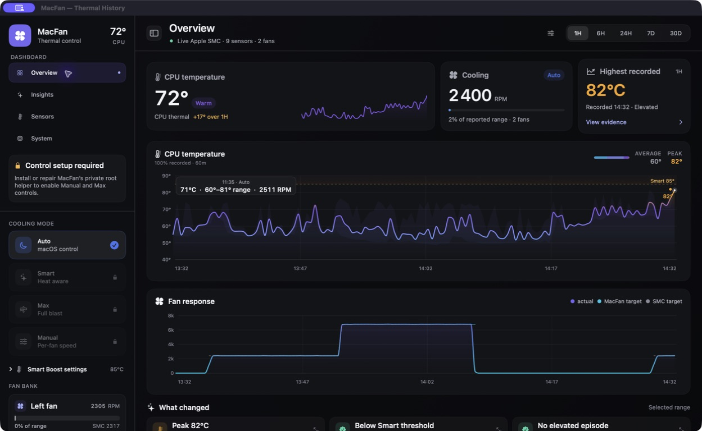
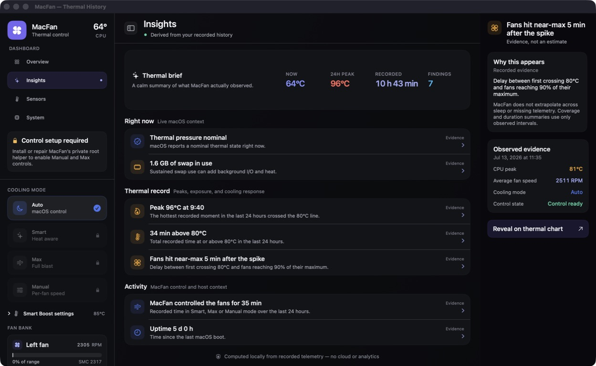
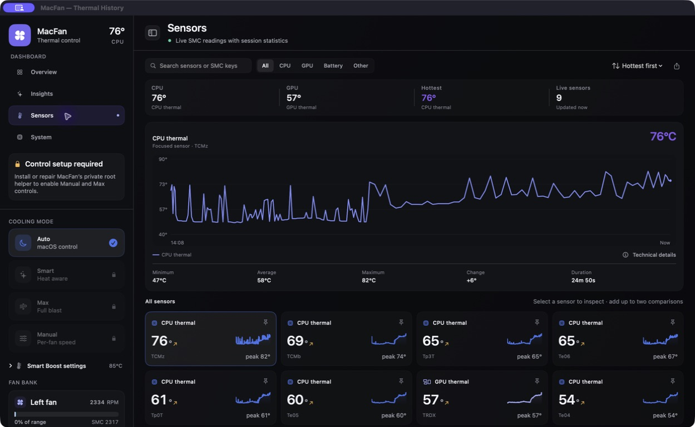

# MacFan

MacFan is a local-first macOS menu-bar app for understanding and managing thermal behavior. It combines a quiet CPU temperature monitor, rich history, useful explanations, and best-effort fan control in one compact interface.

Current release: **0.1.2** · See the [changelog](CHANGELOG.md) for what changed.



> **Important:** fan writes use private Apple Silicon interfaces and are not supported by Apple. Monitoring is the guaranteed feature; direct control is enabled only after the installed helper proves that the hardware responds and remains protected by automatic failsafes.

## Why MacFan

- **A truthful headline:** the menu bar and charts use CPU temperature as the primary thermal signal, while the full sensor set stays available when you need to investigate.
- **Fast actions:** Auto returns control to macOS, Smart responds to heat with hysteresis, Max requests maximum cooling, and Manual exposes per-fan targets when the machine and helper allow it.
- **Useful history:** linked temperature and RPM charts, selectable time ranges, peak annotations, thermal episodes, and plain-language findings show what happened rather than only displaying a number.
- **Focused diagnostics:** the Sensors view supports search, categories, comparison, technical details, and per-sensor statistics without turning the app into a generic system monitor.
- **Local and lightweight:** no account, cloud service, analytics, or network telemetry. In idle Auto mode the app is designed to do very little work.





## Requirements

- Apple Silicon Mac
- macOS 14 or later
- Xcode 16 or later for building from source
- [XcodeGen](https://github.com/yonaskolb/XcodeGen) for regenerating the project file

Read-only monitoring works without the privileged helper. Control availability depends on the macOS release, firmware, discovered hardware, and whether another fan controller is active.

## Install locally

The repository includes a guided installer for a single Mac. From the repository root:

```sh
zsh Scripts/install-local.sh
```

The installer builds an arm64 release, installs the canonical `MacFan.app` in `/Applications`, installs the narrowly scoped helper and LaunchDaemon after one administrator authorization, runs a read-only preflight, and opens the app. It never uploads telemetry or asks for an account. The helper can be repaired or removed with the same script; run `zsh Scripts/install-local.sh --help` for options.

Because this is an unsigned local build, macOS may ask you to confirm the first launch in **System Settings → Privacy & Security**.

## Build and run without installing the helper

```sh
xcodegen generate
xcodebuild -project MacFan.xcodeproj \
  -scheme MacFan \
  -configuration Debug \
  -destination 'platform=macOS,arch=arm64' \
  -derivedDataPath build/DerivedData build
open build/DerivedData/Build/Products/Debug/MacFan.app
```

## Test

```sh
xcodebuild -project MacFan.xcodeproj \
  -scheme MacFan \
  -destination 'platform=macOS,arch=arm64' test
```

The unit and UI suites use deterministic fixture telemetry and an in-memory database where possible. They do not require fan writes and do not modify a user’s thermal history.

## Control model and safety

MacFan never accepts arbitrary SMC keys, shell commands, paths, or raw bytes from the app. Its privileged helper exposes only semantic operations: capabilities, preflight, mode changes, bounded targets, heartbeat, and restoration to System. Requests are authenticated, clamped to the discovered fan limits, and rejected when telemetry is invalid.

Every override has a lease and heartbeat. On app quit, helper failure, lost heartbeat, sleep/wake, invalid telemetry, timeout, or failed verification, the helper restores macOS control. The UI only labels a mode active after actual hardware state confirms it. Do not run two fan controllers at once, and do not leave a manual override active while transporting the Mac.

## Data and privacy

MacFan has no cloud service, account, analytics, or public API. Detailed samples and compact rollups are stored locally in:

```text
~/Library/Application Support/MacFan/telemetry.sqlite
```

The database, build products, Xcode user data, signing material, and local configuration are ignored by Git. Please remove or redact telemetry before attaching diagnostics to an issue.

## Project status

Monitoring and analysis are intended to remain reliable across macOS updates. Fan control is intentionally experimental: Apple Silicon SMC behavior is private and may be firmware- or OS-limited. If control is unavailable, MacFan remains a complete monitor and says so clearly.

## Contributing and security

See [CONTRIBUTING.md](CONTRIBUTING.md) for the project guardrails and [SECURITY.md](SECURITY.md) for reporting a potential vulnerability. Third-party notices are collected in [THIRD_PARTY_NOTICES.md](THIRD_PARTY_NOTICES.md).

## License

MacFan is released under the [MIT License](LICENSE).
